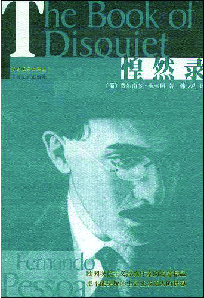

“有时候，我认为我永远不会离开道拉多雷斯大街了。一旦写下这句话。它对于我来说，就如同永恒的谶言。”读到开头这句话的时候，我完全被震撼住了，我无法描述出那一刻心中的感受。因为佩索阿写下了永恒。

费尔南多·佩索阿1888年6月生于葡萄牙里斯本，父亲在他不满6岁时病逝，从1908年起，佩索阿一直独自一人生活。除此之外，他就如卡夫卡一样，只是里斯本一个公司的小职员，整天默默工作，从来不多说一句话。正如他自己所说的：“我从来不求被他人理解。被理解类似于自我卖淫。”但卡夫卡对于周围环境的敏感，总是令人为之不安。而佩索阿一生乐于充当一名公司小职员，他安于自己小小的社会角色，始终坚定不移地固守自己的写字桌，就像一直远航的船只渴念码头。“我走近我的写字台，如同它是抗击生活的堡垒。我有一种如此不可阻挡的温柔的感动。”这种不可阻挡的温柔，使他有别于卡夫卡。温柔是对世界的软化，对工业时代、战争、专制、粗糙的生活，对一切坚硬事物的最决绝的反抗。因此他对待自己朝夕相处的同事和上司时，感觉到“我的某一部分将与他们共存，失去他们的我将与死无异”。“即便整个世界被我握在手中，我也会把它统统换成一张返回道拉多雷斯大街的电车票”。无论能否成为V公司的主管会计，还是在临终前写下“我不知道明天将会带来些什么”，除了能够写作，他知道自己和他们在本质上没有什么不同。他的灵魂从来没有停止过骚动，虽然他并不觉得思考是多么高贵的事，但他相信：“思考比生存更好，这是我的不幸，与其他所有的大不幸随行。”他注定是孤独的，因为他的思考就如同西西弗斯，永远向前而又返身自看，自我始终在镜像中凝视。他的感知，来自于敏锐的洞察。他以令人羡慕的耐力向内勘探，黑暗之心如同一个回声阵阵的深渊，通过收集回声他树立起一座内心的金字塔，这是一座“自我意识”的宏大塔楼，它与外在的宇宙构成了一种诙谐的、颠倒的关系——意识之微的体察往往能放大成占据整个虚无空间的冥想。我们越是解剖自己，越是将个体的感觉一一供示出来，我们对“世界”的依靠程度也就越低。那无限的向内、向内、再向内的倾斜，让整个世界在这一道像大地一样空旷的斜坡上变得轻盈、透明、可以理解；即使仍不可理解，至少也与我们达成一种柔和的谅解。

佩索阿平素极少出门，甚至在17岁以后的30年里几乎没离开过里斯本。他或许是除康德以外最讨厌旅行的人，除了深夜的独自幻想之外，连里斯本以外的很多地方都很少去过。佩索阿认为，存在本身就是一种旅行。“世界的终点以及世界的起点，只不过是我们有关世界的概念。仅仅是在我们的內心里，景观才成其为景观。旅行者本身就是旅行。我们看到的，并不是我们所看到的，而是我们自己。”在这个意义上他也称自己为静止的旅行者和“第八大洲”的旅行者：“我对世界七大洲的任何地方既沒有兴趣，也沒有真正去看过。我游历我自己的第八大洲。有些人航游了每一个大洋，但很少航游他自己的单调。我的航程比所有人的都要遥远。我见过的高山多于地球上所有存在的高山。我走过的城市多于已经建立起来的城市。我渡过的大河在一个不可能的世界里奔流不息，在我沉思的凝视下确凿无疑地奔流。如果旅行的话，我只能找到一个模糊不清的复制品，它复制着我无须旅行就已经看见了的东西。”的确，我们不必再为自己沒有去过什么地方而感到惶恐不安，最重要的，乃是拥有广阔而丰富的內心世界。记得很早以前读《老子》中的那句“不出户，知天下；不窥牖，见天道。其出弥远，其知弥少”总觉难以理解，如今读到佩氏此语，顿觉豁然开朗。一个拥有着丰富内心的人对于外界的依赖最少，因此也是最为完满自足的。他以卑微之躯处蜗居之室，一个人担当了全人类的精神责任，始终一贯地保持了对于一切事物深深关切的博大情怀。

佩索阿的生活单调规律，每天准时上下班，对于这种单调的生活和写作的关系，佩索阿在日记中有所描述：“聪明人把他的生活变得单调，以便使最小的事故都富有伟大的意义。……哪里有新奇，哪里就有见多不怪的厌倦，而后者总是毁灭了前者。真正的聪明人，都能够从他自己的躺椅里欣赏整个世界的壮景，无须同任何人说话，无须了解任何阅读的方法，他仅仅需要知道如何运用自己的五种感官，还有一颗灵魂里纯真的悲哀。”毫无疑问，佩索阿的灵魂里正好有这种纯真的悲哀，因而他躺在里斯本这张躺椅上就可以欣赏整个世界，而且顺便将这个世界贮藏在文字中。整部随笔都像在他写作的间歇——当他写累了，在深夜停下笔来，看着窗外寂静的街道，想起了白天见到的一些人和场景，虽然普通，但在这样的深夜，在人的思维的深夜，它们似乎也突然具备了伟大的意义。对于他本人而言，写作是对于自己内心的一次访问，以飘浮的语词刻画出内心真实的喜悦与忧郁，悸动与不安交织的交响乐。

在这本书中，你可以看到佩索阿有意识地分裂自己，变换另一种视角，以他者的身份和视角介入写作；随后，他又以自省的态度站在一边检阅自己的作品；他获得了更多地体验生活的机会。孤独使他创造出许多想象中的伙伴，那些变中的恒，异中的同，让他在不同的角色中穿梭自如。他的立场时有转换，有时精神化有时物质化，有时个人化有时社会化，有时贵族化有时平民化，有时科学化有时信仰化，“一直在心灵中自我否定”。但正如韩少功在译序里所言，较之执著定规，他的自相矛盾常常是智者的犹疑；较之滔滔确论，他的不知所云常常是诚者的审慎。这是变中有恒，异中有同，是自相矛盾中的坚定，是不知所云中的明确。这恒与同、坚定与明确，就是独自一人面向全世界顽强突围的精神气质！

佩索阿生在革命的年代，死于独裁年代，但是这个羞怯而忧郁的外交官继子并不关心时代的洪流。他厌恶他的时代，同时也是一个极度厌恶政治的人：“对世界的统治始于我们对自己的统治。统治世界的既不是忠诚，也不是不忠诚。统治者是这样一些人，他们以造作和不由自主的方式，在自己身上制造出一种真正的忠诚；这种忠诚构成他们的力量，闪闪发光，使其他人的虚假忠诚黯然失色。一种自我欺骗的杰出天才，是政治家们最起码的素质。”——这里对政治的鄙薄不言自明，比那些从正面抨击政治之肮脏的做法还要入木三分。他反对一切暴力，视其为“人类愚笨品质特有的疯癫的特例”，这是无数血淋淋的生命证明的历史真相。他的目光深入黑暗的核心：“如果一个人真正敏感而且有正确的理由，感到要关切世界的邪恶和非义，那么他自然要在这些东西最早显现并且最接近根源的地方，来寻求对它们的纠正，他将要发现，这个地方就是他自己的存在。这个纠正的任务将耗尽他整整一生的时光。”这是他对革命和改良的思考。

作为一个诗人，佩索阿的文字特别典雅、精准、洁净，充满了诗性之美和智性之美，体现了对思想对生活一种智慧的悟力，穿透了尘世和自然。比如:“纯粹，就是不要一心想成为高贵或者强大的人，而是成为自己”、“一个人只能看见他已经看见过的东西”、“我们把生活想象成什么样，它就是什么样。生活全看我们是如何把它造就”、“秋天不是在世界里而是在我们内心中开始”等等。书中这些令我心有戚戚焉或常想猛击一掌的句子和段落，委实甚多。只要你不断阅读佩索阿，你会发现他博大无限的感知。博尔赫斯的小说《沙之书》,里面讲到一本读不完的书，页与页之间总还有其他的页，无穷无尽，最后作家将它藏在了90万册图书中。对我来说，《惶然录》就是一本读不完的书，什么时候阅读都会像初次阅读那样，字里行间总有新的空地浮现出来。

梭罗曾说：“一个人可以从小地方意识到伟大的存在。”读佩索阿的《惶然录》，让我深刻地感受到这一点。这个在隐秘的角落度过短暂一生的思想者，用他诗性的语辞，带领读者通向澄明之境，那里没有绝望、愤怒、怨怼、诅咒，只有无上的欣喜和这种欣喜带来的不安与惶然。最后，我还是想用开篇的这句话来结束这篇文章：“有时候，我认为我永远也不会离开道拉多雷斯大街了。一旦写下这句话，它对于我来说就如同永恒的谶言。”

是的，写下就是永恒。且让我们静静地翻开《惶然录》，读一读永恒的佩索阿。

> 书香中国 □孔戈碧